# Lotus Pavilion - Asian Cuisine Web Menu
 - 

## Table of Contents
1. [Link to Website](https://django-menu-87d486944791.herokuapp.com/)
2. [Introduction](#introduction)
3. [Project Goal](#project-goal)
4. [Strategy](#strategy)
5. [User Stories](#user-stories)
6. [Features](#features)
7. [Design](#design)
8. [Data Model](#data-model)
9. [Technology Stack](#technology-stack)
10. [Testing](#testing)
11. [Bugs and Solutions](#bugs-and-solutions)
12. [Deployment](#deployment)
13. [Credits](#credits)
14. [Acknowledgements](#acknowledgements)


Welcome to the Lotus Pavilion, an Asian cuisine restaurant that brings the convenience of exploring our diverse menu right to your fingertips. My project, hosted at [herokuapp.com](https://django-menu-87d486944791.herokuapp.com/), offers a web version of our restaurant's menu, designed to enhance the dining experience of our guests even before an attendant presents them with a physical menu. By simply scanning a QR code found on promotional materials within the establishment, visitors can delve into our offerings, enjoying an intuitive navigation system for searching and sorting dishes. Additionally, our web menu features a review functionality for dishes, aiding in decision-making and distinguishing our service in a competitive market.

## Project Goal

The objective of this project, as assigned by [Code Institute](https://codeinstitute.net/ie/), is to construct a website facilitating multiple users to interact with a shared database, exemplified by capabilities such as performing CRUD (Create, Read, Update, Delete) operations. This endeavor aims to showcase the practical application of Django models, a login system, user access separation (e.g., admins vs. non-admins, object owners vs. non-owners), and agile project management, culminating in a comprehensive digital solution that serves both the restaurant and its patrons.

## Strategy

During the development of the Lotus Pavilion web menu, we adopted an Agile methodology, leveraging a Kanban board via GitHub Projects for task management and workflow optimization. User stories were prioritized using the MoSCoW method, guiding our development focus towards delivering the highest value features. The project was deployed on Heroku with PostgreSQL as the database solution and Cloudinary for media storage, ensuring a seamless and efficient backend and media management. The frontend utilized a Bootstrap template, significantly reducing development time. Our choice of Django for the backend accelerated the development process further, thanks to its comprehensive suite of out-of-the-box functionalities, including a fully-featured admin panel. This strategic combination of technologies and methodologies enabled us to create an intuitive, efficient web menu system for the Lotus Pavilion, enhancing the dining experience for our guests.

### User Stories

#### Planned for Future Implementation
- **Dish Availability Display**: To show if a dish is currently available or not.
- **Newsletter Subscription**: To allow users to subscribe to updates and news.
- **Collect Feedback**: To enable users to provide feedback on dishes.

#### Epic 1: User Account Management
- **Create an Account**: "As a user, I want to create an account so that I can have a personalized experience."
- **Log In**: "As a user, I want to log in to my account so that I can access my personal settings."
- **Log Out**: "As a user, I want to log out of my account so that my account is secure when not in use."
- **Update Profile**: "As a user, I can update my profile information so that my personal information is up to date."

#### Epic 2: Site Stability and Performance
- **Testing**: "As a restaurant owner, I want my site to operate stably so that the user experience is improved."

#### Epic 3: Menu Interaction
- **Electronic Menu**: "As a restaurant visitor, I can open the website to view the electronic menu so that I can choose a dish conveniently."
- **Search the Menu**: "As a restaurant visitor, I want to have the ability to search the menu so that I can find dishes quickly."
- **Filter Option**: "As a client, I want to filter dishes so that I can browse promotional items easily."

#### Epic 4: Reviews Management
- **Leave Reviews**: "As a user, I want to leave reviews about dishes so that I can help others make an informed choice."
- **Display Reviews**: "As a user, I want to read reviews about dishes so that I can make a more informed decision."

#### Epic 5: Menu Administration
- **Setup Menu from Admin Panel**: "As a restaurant owner, I want to add and remove dishes from the menu so that I can keep the menu up-to-date."

#### Epic 6: Website Setup and Deployment
- **Setup and Deploy**: "As a restaurant owner, I want to create a website with an electronic version of the menu to enhance convenience for users."

#### Epic 7: Customer Engagement and Feedback
- **Newsletter Subscription**: "As a user, I can subscribe to a newsletter so that I can stay informed about the latest news and offers."
- **Collect Feedback**: "As the website owner, I can collect feedback directly from users to understand their needs and improve the website."

For detailed descriptions and acceptance criteria of each user story, please visit the [User Stories section on GitHub](https://github.com/app-wizard/django-menu/issues).

## Features

### Existing Features

- **Homepage**
  - The homepage greets visitors with a captivating slogan and a photograph of the restaurant's interior, immersing them in the ambiance of Asian cuisine.
  - 
- **Menu Navigation Button**
  - This functional button enables visitors to view all dishes or navigate to specific categories within the menu.
  - 

- **Information Section**
  - Offers detailed information about the restaurant, allowing visitors to learn more about what makes it special.
  - 

- **Delivery Information Section**
  - Provides essential details regarding delivery services.
  - 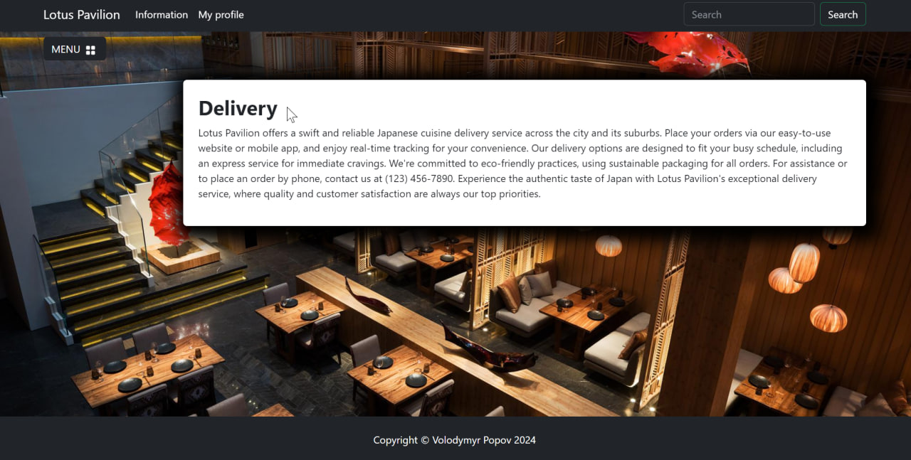

- **About Us Information Section**
  - Provides essential details regarding company.
  - 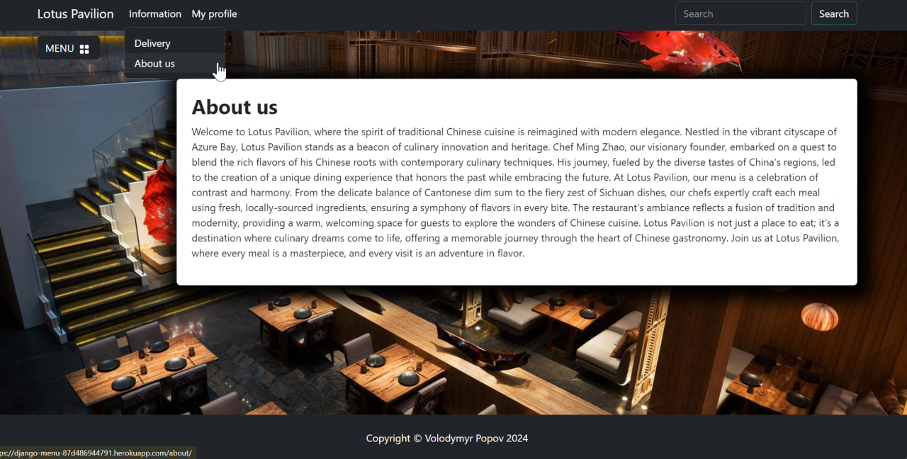

- **Sign In Section**
  - Directs users to a login page, where they can either sign in or proceed to register a new account.
  - 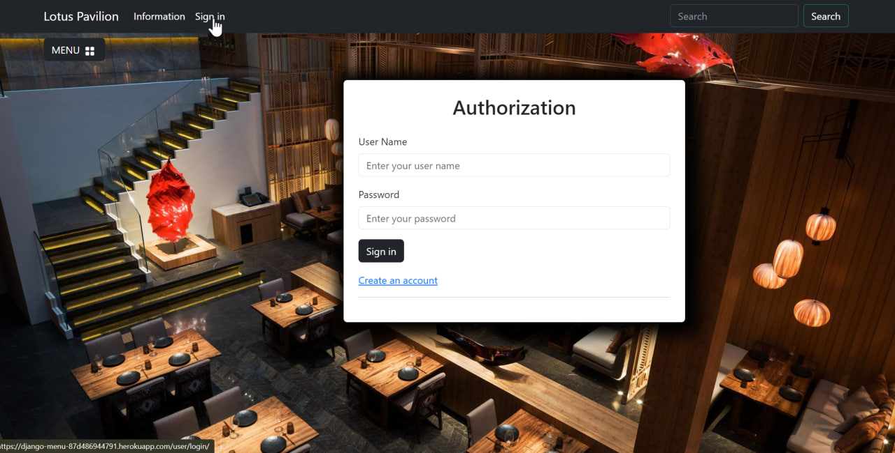
  - 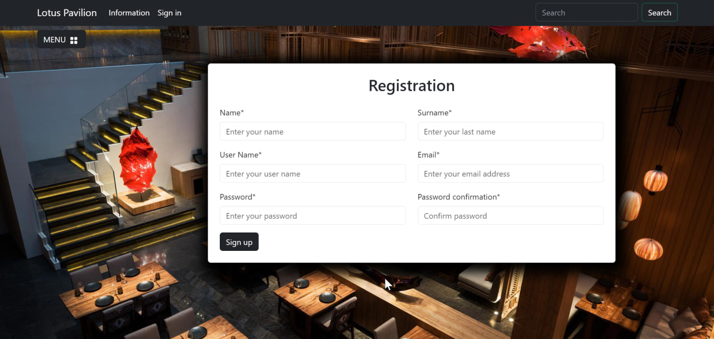
  

- **Administrator Access**
  - Admin users are provided with a dedicated admin panel for comprehensive site management.
  - 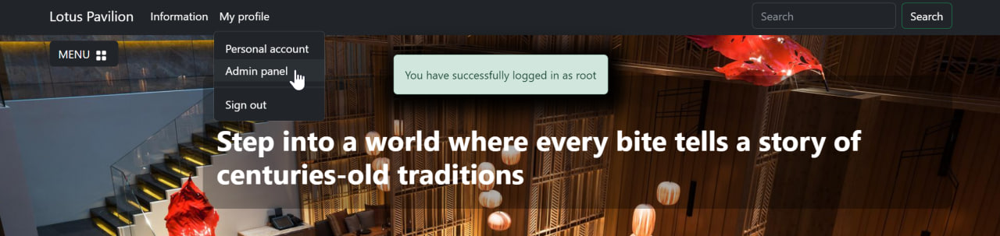

- **User Profile Page**
  - A page that allows all users to update their personal information and customize their profile photo.
  - 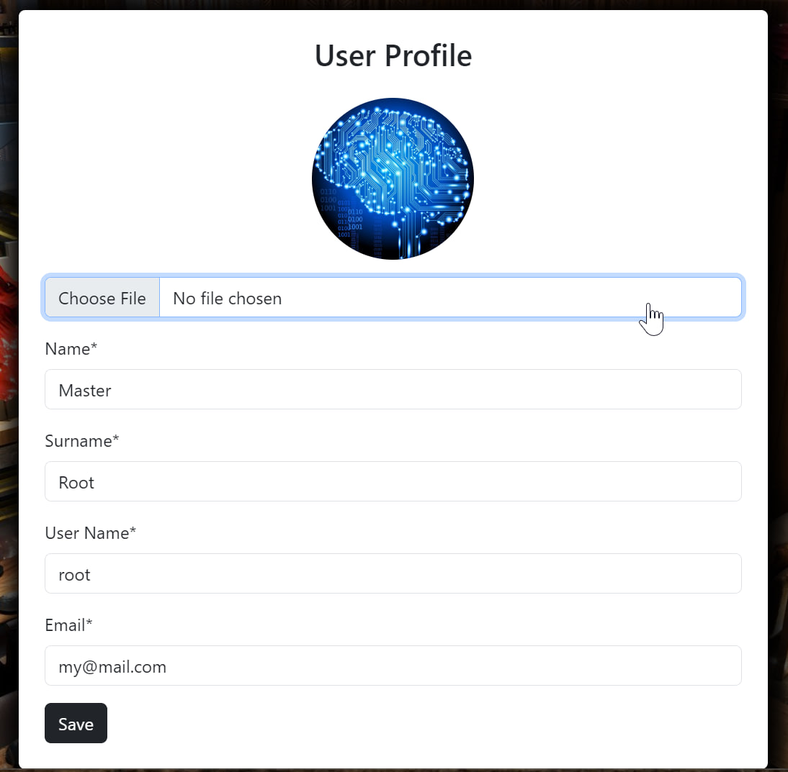

- **Full-text Search**
  - Embedded in the site's header, this feature supports efficient searches across the menu, with additional methods to prevent empty query searches.
  - 
  - 

- **Search Results Page**
  - Displays either a "no results found" message for unsuccessful searches or a catalog page with items for successful searches.
  - 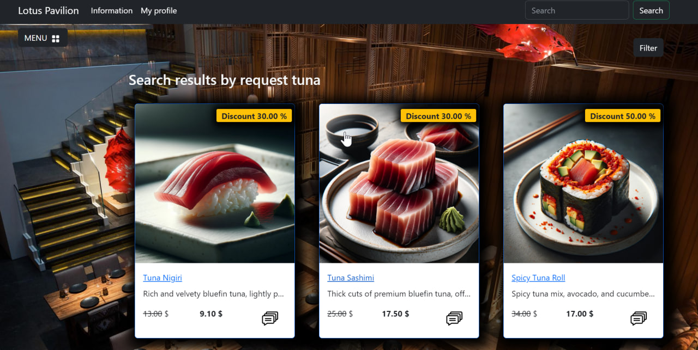
  - 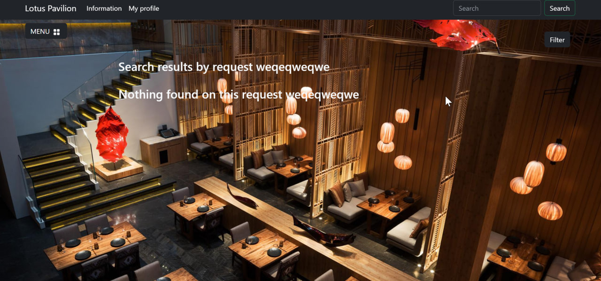

- **Catalog Page**
  - Showcases dishes from the menu with pricing and brief descriptions, complemented by pagination for easier navigation.
  - 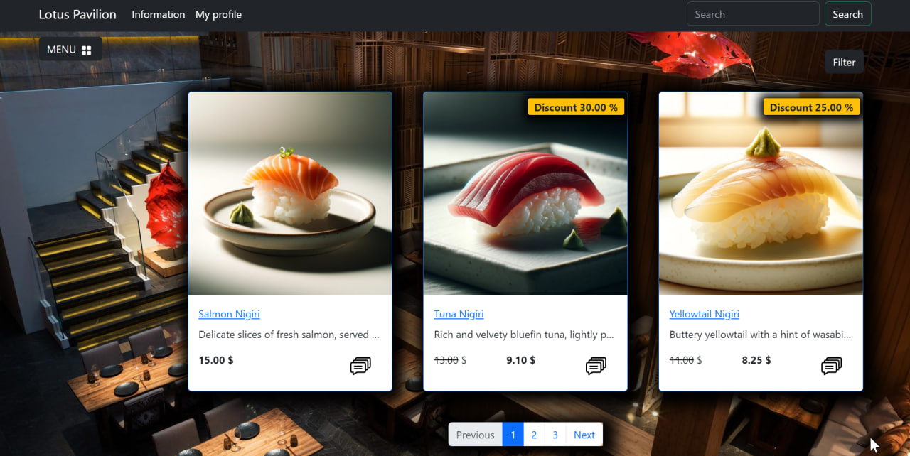

- **Filtering Functionality**
  - Allows users to filter dishes by discounts and sort them by ascending or descending prices.
  - 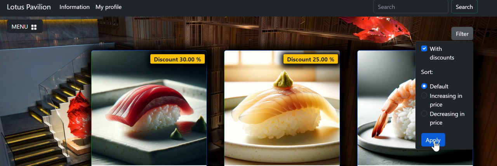

- **Product Page**
  - By clicking on a dish card, users are taken to a detailed page where they can view an enlarged photo, and read or leave comments.
  - 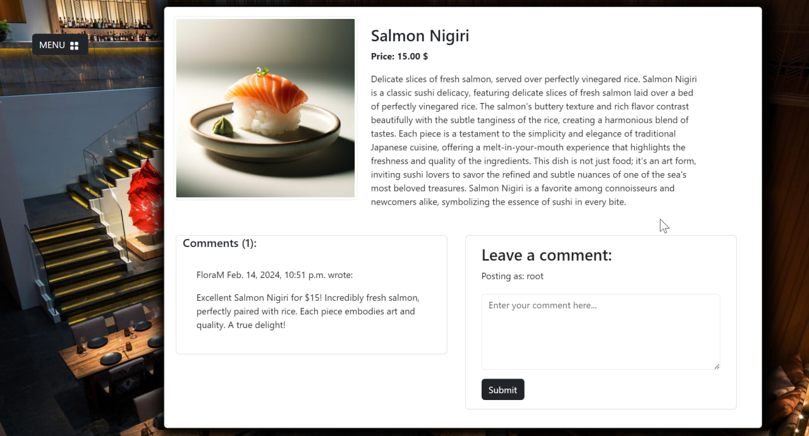

- **Comment Functionality**
  - Restricted to registered users for posting, with the ability to edit or delete their comments. Unconfirmed comments are only visible to their authors.
  - 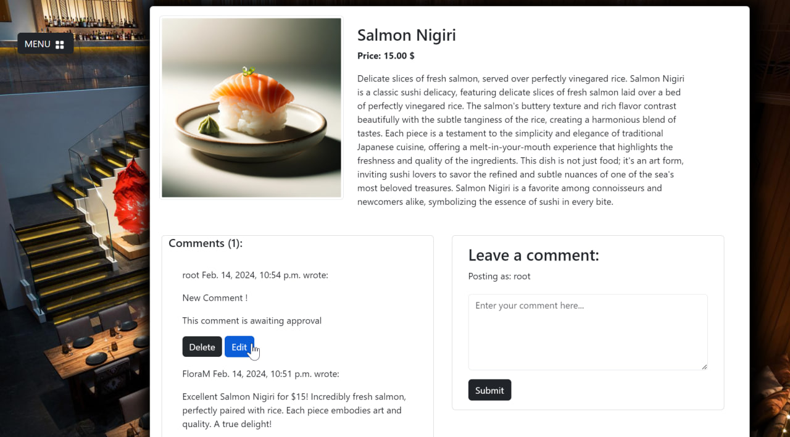

- **Pop-up Messages**
  - Utilizes convenient pop-up messages to notify users about various actions.
  - 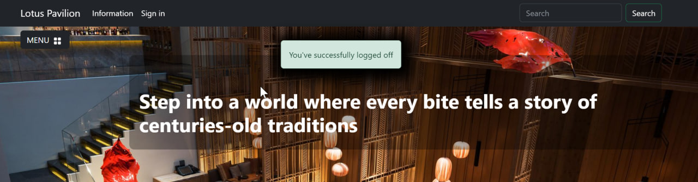

- **Admin Panel Customization**
  - For administrators, the admin panel has been customized for ease of use, including features for confirming comments and adjusting menu items and prices.
  - 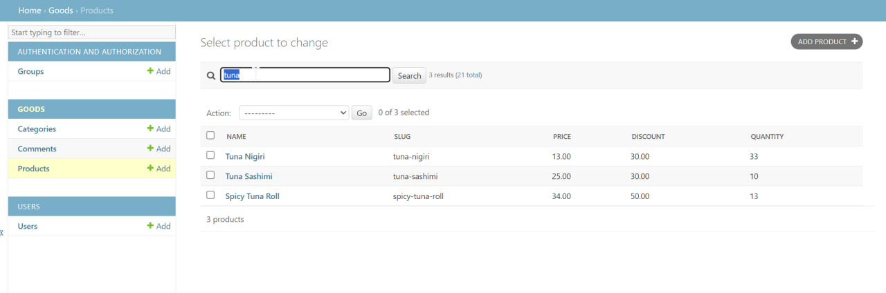
  - 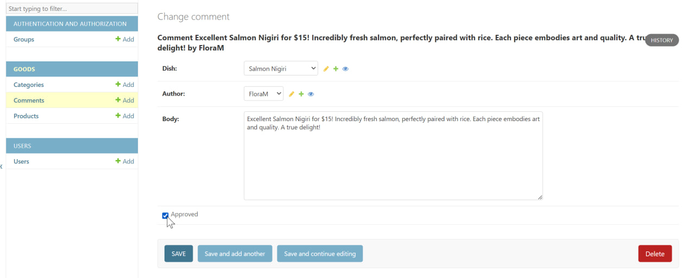

### Features to Implement in the Future

In addition to addressing the currently unimplemented user stories, future enhancements of the Lotus Pavilion web menu are planned to significantly improve user engagement and compliance with legal standards:

- **Dish Availability Display**: Introducing real-time status updates on dish availability to help customers make informed choices.
- **Newsletter Subscription**: Implementing a subscription feature for customers to stay updated with the latest news and offers.
- **Collect Feedback**: Creating a platform for customers to provide feedback on dishes and services, fostering a community and improving customer satisfaction.

Further improvements are aimed at enhancing the user registration process by:

- Enabling login through Google and social media platforms for a more streamlined and convenient user experience.
- Providing users with the ability to delete their accounts, ensuring a transparent and trustful interaction with the service.

Additionally, the privacy policy section will be expanded to fully comply with current legislation, ensuring that the Lotus Pavilion's web menu not only meets but exceeds legal requirements for privacy and data protection.

## Design

The design of the Lotus Pavilion web menu is a testament to the fusion of tradition and modernity, encapsulating the essence of Asian culinary excellence. The website's visual narrative is crafted with an exquisite blend of rich wooden textures and a warm, inviting color palette, featuring deep browns and muted golds that echo the elegance of the restaurant's physical space.

### Color Scheme and Typography
The color scheme is a thoughtful selection of earthy tones, accented with the vibrant hues of Asian spices and the serene ambiance of a traditional lotus pond at dusk. This palette is harmoniously paired with a clean and contemporary typography that balances the visual warmth with crisp readability.

### Responsiveness and Interactivity
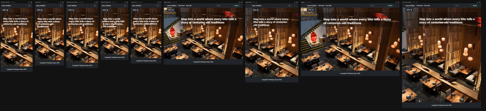
Attention to responsive design ensures that the site's allure is preserved across all devices, offering an inviting and seamless experience whether on desktop or mobile. Interactive elements, such as the filter dropdown and search functionality, are designed for intuitive engagement, inviting users to explore the menu with ease.

### Imagery and Aesthetics
High-resolution images showcase the menu offerings, with each dish presented as a work of art, highlighting the fresh ingredients and meticulous presentation. The homepage sets the stage with a narrative, "Step into a world where every bite tells a story of centuries-old traditions," inviting visitors on a culinary journey.

### Custom Styling and Bootstrap Framework
The foundation of the design is built on a Bootstrap template, which accelerates development and ensures a high level of polish with its pre-designed components. Custom styles are layered to enhance unique features, adding character and personality to the site. This combination guarantees both efficiency in development and a bespoke user interface.

### Data Model

The Lotus Pavilion web menu leverages a robust data model hosted on Heroku with PostgreSQL (https://www.elephantsql.com/) for database services. For media storage, Cloudinary is employed, effectively managing the images associated with the menu items.

The data model is structured around several core Django models:

- `User`: Built on Django's default user model, extended with an image field via Cloudinary for user profile pictures.
- `Category`: Represents different categories under which menu items are organized, with fields for name and slug.
- `Product`: The central entity representing individual menu items, linked to `Category` with fields for name, description, image, price, discount, and quantity.
- `Comment`: Allows for user interaction with the menu items, containing fields for the comment body, approval status, creation timestamp, and foreign keys linking to `User` and `Product`.

The ERD encapsulates the relationships between these models, with `Product` being associated with `Category` and `Comment` being related to both `Product` and `User`. The diagram highlights the one-to-many relationships, where a single category can encompass multiple products, and a product can have numerous comments from different users.

Entity Relationship Diagram:

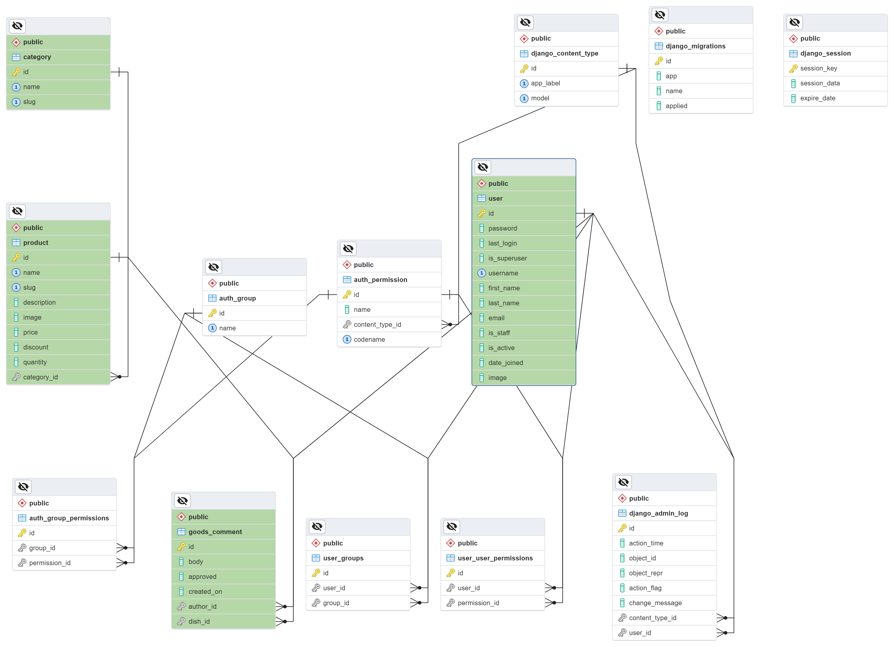

### Imagery

The Lotus Pavilion's digital menu is a visual feast, showcasing a selection of images that capture the essence and allure of Asian cuisine. 

#### Unique Menu Item Visuals
The menu's imagery is not static; each dish is vividly brought to life with unique visuals generated by [Craiyon](https://www.craiyon.com/), an AI-powered service that pushes the boundaries of graphic generation. Complementing these are resources from [Freepik](https://www.freepik.com/), which provide a rich library of graphical elements that enhance the storytelling of our culinary offerings.

#### Cloudinary for Media Management
For managing these images, [Cloudinary](https://cloudinary.com/)'s cloud-based platform is utilized, ensuring that the visual assets are optimized for performance across all devices and user scenarios. Cloudinary's service enables dynamic manipulation of images, which is essential for maintaining responsiveness and visual impact in a diverse digital landscape.

### Languages Used:

- HTML5
- CSS3
- JavaScript
- Python

### Frameworks, Libraries, and Packages Used:

- [Bootstrap:](https://getbootstrap.com/) The Bootstrap framework facilitated the creation of a responsive and visually appealing web interface.
- [Cloudinary:](https://cloudinary.com/) Cloudinary was utilized for robust image management and storage solutions.
- [Django:](https://www.djangoproject.com/) Django served as the backbone web framework due to its versatility and security features.
- [Django Crispy Forms:](https://django-crispy-forms.readthedocs.io/en/latest/) This extension was employed to render elegant Django forms quickly.
- [Gunicorn:](https://gunicorn.org/) Gunicorn acted as the HTTP server, interfacing with Django to serve web pages on Heroku.
- [Django Crispy Bootstrap 5:](https://django-crispy-forms.readthedocs.io/en/latest/) Enhanced form rendering using Bootstrap 5 style.
- [DJ-Database-URL:](https://pypi.org/project/dj-database-url/) This utility allows for database configurations to be defined by a URL.
- [DJ3-Cloudinary-Storage:](https://pypi.org/project/dj3-cloudinary-storage/) An integration layer for storing media files with Cloudinary in Django 3+.
- [Psycopg2:](https://pypi.org/project/psycopg2/) The PostgreSQL adapter for Python, facilitating database connections and operations.
- [Whitenoise:](http://whitenoise.evans.io/en/stable/) Allows the app to serve its own static files, making it self-contained and reducing the dependency on external services.

#### Visual Studio Code Extensions:
- Live Server: For real-time local development.
- Pylance: Python language support with type checking and auto-completion.
- ESLint: JavaScript linting.
- Django: Syntax support for Django templates.

#### Command Line Tools:
- [Git](https://git-scm.com/): Version control.
- [Heroku CLI](https://devcenter.heroku.com/articles/heroku-cli): Deploying and managing the Heroku app.
- Black: Code formatting.
- flake8: Code quality checking.

These tools and extensions have been instrumental in building a robust and user-friendly web application, ensuring a streamlined workflow and high-quality code.

#### Web Applications Used for Development and Testing:
- [Chrome DevTools](https://developer.chrome.com/docs/devtools/): For testing, debugging, and performance analysis.
- [HTML Validator](https://validator.w3.org/) and [W3 CSS Validator](https://jigsaw.w3.org/css-validator/): To validate HTML and CSS files.
- [JSHint](https://jshint.com/): To check JavaScript code quality.
- [Photoshop](https://www.adobe.com/products/photoshop.html): Image editing and customization.
- [Unsplash](https://unsplash.com/): High-quality stock photography.

## Testing

### Browser Compatibility

The application underwent comprehensive testing on a MacBook Air (Retina, 13-inch, 2018) running macOS Monterey 12.5, utilizing the following browsers to ensure optimal performance and compatibility:

- Safari 14
- Google Chrome Version 121.0.6167.160
- Firefox Browser Version 122.0.1

Additionally, mobile testing was conducted on iOS devices with Safari Version 15.6:

- iPhone 12 Pro Max running iOS 17.3

### Responsiveness

Responsiveness was meticulously tested across various devices, from the compact iPhone 5 screen (320px wide) to expansive displays such as the 5K iMac Pro (5120 x 2880 px), ensuring a seamless user experience across a broad spectrum of screen sizes.

#### W3C Markup Validator:

The W3C Markup Validator were used to validate the HTML on all pages of the project to ensure there were no syntax errors in there. To validate the HTML files all Django template tags were manually removed with the HTML code copied and inserted to the base template.

Home page:
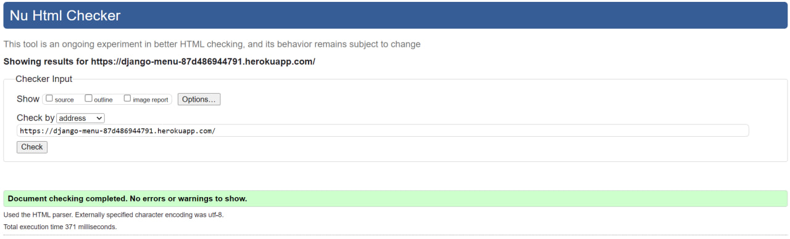

Delivery page:
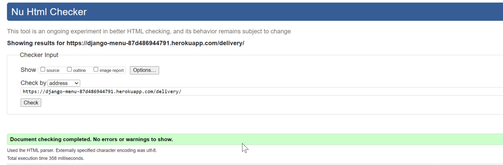

About Us page:
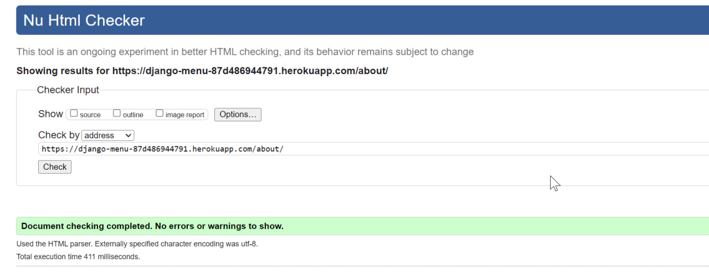

Profile page:
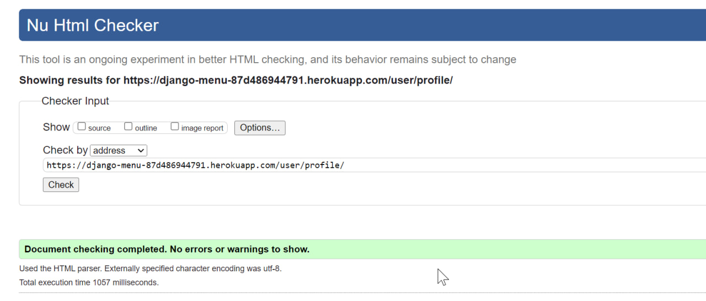

Catalog page:
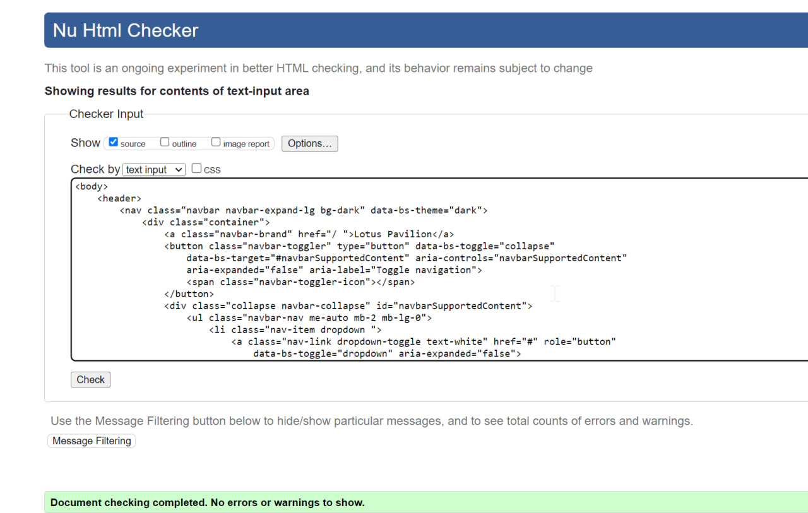

Product page:
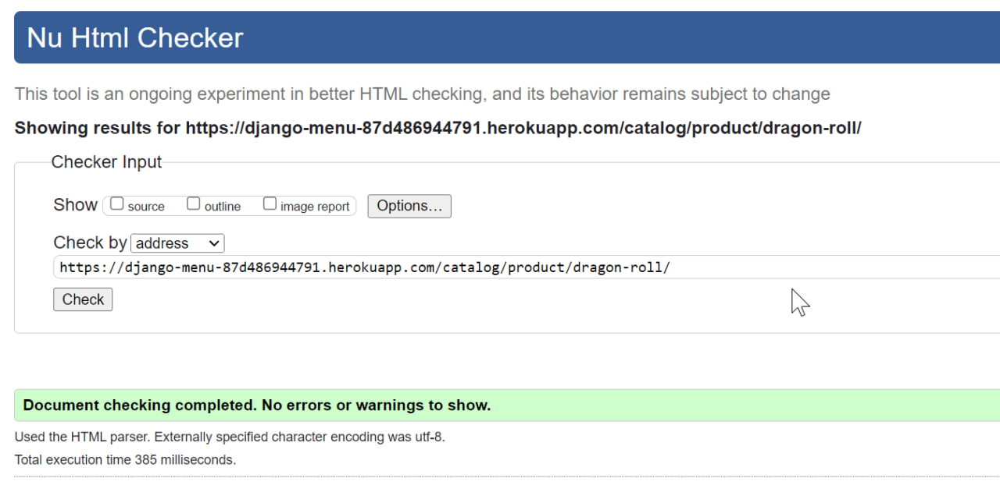

#### JSHint:

JSHint was used to validate the JavaScript with no errors highlighted.

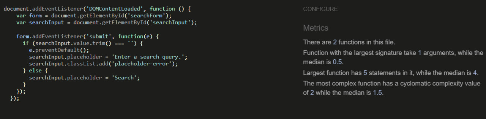

#### PEP8 Online:

PEP8 Online linter (Python validator) The code passed without any errors on all files tested:

## Performance and Accessibility Report

### Lighthouse Audit

Our website underwent extensive testing with Google's Lighthouse tool, ensuring our commitment to best practices in web development. We are thrilled to report outstanding results across multiple metrics:

- **Performance**: 98/100
- **Accessibility**: 100/100
- **Best Practices**: 100/100
- **SEO**: 90/100

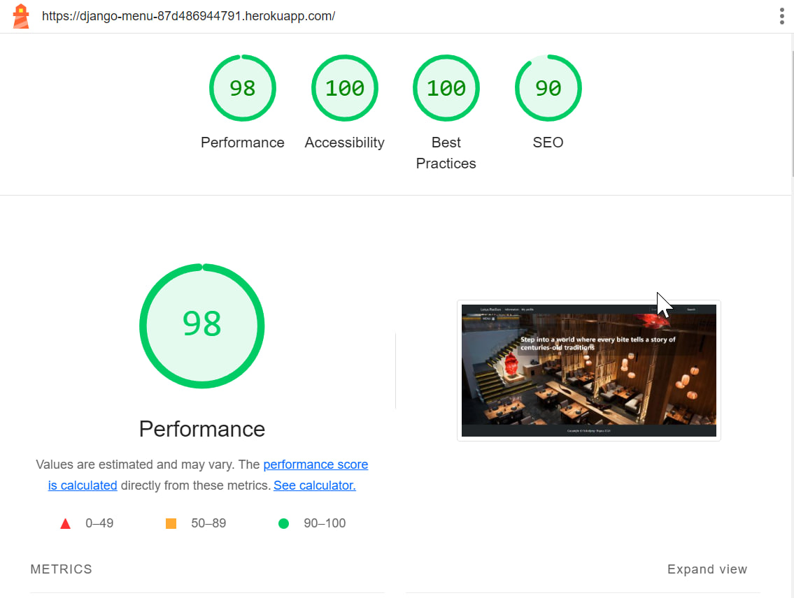

These scores are a testament to our dedication to creating a fast, accessible, and search-engine friendly website. Lighthouse's thorough analysis simulates various conditions, providing us with a detailed report to fine-tune our site performance.

> Performance is calculated directly from these metrics, reflecting the user's real-world experience on the site. For more details on how the performance score is calculated, see the [Lighthouse performance scoring calculator](https://web.dev/performance-scoring/).

## Testing Strategy

Our application's robustness is ensured through a combination of automated and manual testing. Below is a breakdown of how each user story was validated to meet its acceptance criteria.

### Automated Tests

#### Epic 1: User Account Management
- **Create an Account**: Automated tests verify that the registration form is accessible from the homepage and requires a username, email, and password.
- **Log In**: Automated tests ensure that the login form is accessible from the homepage and requires an email and password.
- **Log Out**: Automatically tested to confirm that the logout option is easily accessible from the user's dashboard.
- **Update Profile**: Automated tests check that users can access their profile settings from their dashboard.

#### Epic 2: Site Stability and Performance
- **Testing**: Automated tests cover critical pathways to ensure site stability.

#### Epic 4: Reviews Management
- **Leave Reviews**: Automated tests confirm that an authorized user can add a review to a dish.
- **Display Reviews**: Automated tests verify that reviews are displayed on the product card.

#### Epic 5: Menu Administration
- **Setup Menu from Admin Panel**: Automated tests ensure that the admin can add and delete products from the menu.

#### Epic 6: Website Setup and Deployment
- **Setup and Deploy**: Automated testing confirms that the website is published and operational on Heroku.

### Manual Tests

#### Epic 3: Menu Interaction
- **Electronic Menu**: Manually tested the display of products in the catalog with details.
- **Search the Menu**: Manually verified the functionality of the search feature.
- **Filter Option**: Conducted manual tests to ensure the filter for promotional items is functioning.
- **Dish Availability Display**: Manually checked that each dish includes an indicator of its availability and that unavailable dishes are clearly distinguished.

#### Epic 7: Customer Engagement and Feedback
- **Collect Feedback**: Manually verified that the feedback form is available and functional on the website.
- **Newsletter Subscription**: Manually tested the subscription process using the form on the homepage to ensure proper registration of user emails.

### Testing Utilities

Our automated tests are implemented using Django's `TestCase` class and include various aspects such as form validations, view accessibilities, and user interactions. Manual testing is conducted to complement automated tests, especially in areas where user interface and experience are crucial.

### How to Run Tests

To run the automated test suite, execute the following command in the terminal:
python manage.py test

### Solved Bugs

#### Bug 1: Import Errors After Renaming `form.py` to `forms.py`

**Issue**: We encountered import errors in our Django application after renaming `form.py` to the Django standard `forms.py`. The error was a result of the project's modules still referring to the old filename, causing the Django framework to fail to locate the new `forms.py` module.

**Resolution**: The issue was systematically resolved by updating all import statements across the project to reflect the new filename. This refactoring included views, tests, and any other module that imported forms from the old `form.py`. After the corrections, the application's functionality was restored to normal.

**Lessons Learned**: This bug underlined the importance of adhering to naming conventions from the start to prevent such issues. It also highlighted the value of thorough refactoring and search-and-replace techniques within the codebase when making such changes.

#### Bug 2: Model Name in Plural Form

**Issue**: An oversight led to a model being incorrectly named in the plural form, which is against the Django convention of using singular model names. This error manifested itself in the Django admin panel where the model was improperly represented.

**Resolution**: Instead of performing a potentially risky and time-consuming database migration to rename the model, we implemented a workaround by using the `class Meta` inner class in the Django model definition. By setting `verbose_name` to "product" and `verbose_name_plural` to "products", we were able to correct the display in the admin panel without the need to alter the database schema.

```python
class Meta:
    verbose_name = "product"
    verbose_name_plural = "products"
```

### Known bugs
  - Currently no known bugs.

## Deployment

This project is hosted on Heroku with a PostgreSQL database managed through ElephantSQL. Follow these guidelines to deploy your own instance:

- Access your Heroku dashboard to manage your applications.
- Start a new app by selecting 'New' followed by 'Create new app'.
- Assign a unique name to your app and choose your region.
- After adding PostgreSQL, open the 'Settings' tab.
- Locate 'Config Vars' and reveal them. Note down the `DATABASE_URL`.
- Locally, within your project's directory, create a `env.py` file.
- Inside `env.py`, assign your Heroku `DATABASE_URL` to `os.environ["DATABASE_URL"]`.
- Generate a secure secret key and assign it to `os.environ["SECRET_KEY"]`.
- Back in Heroku, in the 'Settings' tab, add your `SECRET_KEY` to the Config Vars.
- Adjust your `settings.py`:
  - Replace the existing secret key with `SECRET_KEY = os.environ.get('SECRET_KEY')`.
  - Configure the `DATABASES` setting to use `DATABASE_URL` from the environment variables.
- Commit your changes and apply the migrations with `python manage.py migrate`.
- For handling static files and media, sign up for a Cloudinary account.
- Copy the Cloudinary API Environment Variable.
- Add this variable to your local `env.py` and also to Heroku's Config Vars as `CLOUDINARY_URL`.
- Temporarily disable static files collection in Heroku by setting `DISABLE_COLLECTSTATIC` to 1.
- Update your `settings.py` to include Cloudinary storage configurations.
- Create directories named `media`, `static`, and `templates` at the root of your project.
- In the root directory, create a `Procfile`.
- Write your application's webserver command into the Procfile, e.g., `web: gunicorn your_project_name.wsgi`.
- Use the terminal to add, commit, and push your changes to Heroku.
- In Heroku, go to the 'Deploy' tab, deploy your branch, and then access your application by clicking 'Open App'.

### Credits
  - [Django documentation:](https://docs.djangoproject.com/en/4.2/) Everything you need to know about Django.
  - [Bootstrap documentation:](https://getbootstrap.com/docs/5.3/getting-started/introduction/) Bootstrap documentation used for styling and to build responsive web pages.
  - [Code Institute:](https://codeinstitute.net/)  I Think Therefore I Blog.
  - [Code Institute Slack Community:](https://app.slack.com/) Slack community for troubleshooting and FAQ.
  - [Code Institute Tutor Support:](https://app.slack.com/) For help and support.
  - [Stack Overflow:](https://stackoverflow.com) For troubleshooting and FAQ.
  - [Template:](https://www.w3schools.com) Bootstrap Template.
  - [Unsplash:](https://unsplash.com/photos/NtkCemIfaiU) Man fishing on river at daytime photo, Chris Sarsgard.
  - [W3Schools:](https://www.w3schools.com) Online Web Tutorials.


### Acknowledgements

- I would like to extend my heartfelt thanks to Brian Macharia from Code Institute for his invaluable code reviews, assistance, and feedback throughout the development of this project. His guidance has been greatly appreciated.